> 🎓 **패스트캠퍼스 실습 프로젝트**
> 본 저장소는 패스트캠퍼스 강의 실습으로 작성한 결과물입니다.

# 🐧 FLAPPY PENGUIN 3D — 잊혀진 날개

웹캠 앞에서 **팔을 새처럼 움직이면** 화면 속 펭귄이 날아가는 레트로 3D 웹게임.

| | |
|---|---|
| ▶ **플레이** | https://ik4utube.github.io/flappy-penguin-3d/play/ |
| 📖 **소개 페이지** | https://ik4utube.github.io/flappy-penguin-3d/ |
| 📋 **기획서** | [PLAN.md](PLAN.md) |

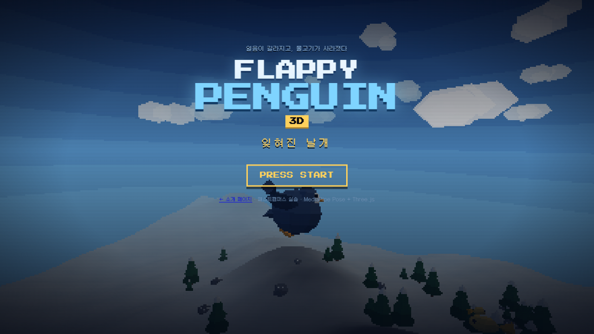

- 동작 인식: **MediaPipe Pose Landmarker** (tasks-vision)
- 3D: **Three.js** — 로우폴리 + 플랫셰이딩 + 저해상도 픽셀 업스케일
- **빌드 도구 없음.** 네이티브 ES 모듈만 쓴다. 저장소의 파일이 곧 실행되는 파일이다.

---

## 게임 흐름

```
타이틀 → 프롤로그(5장) → 캐릭터 선택(6종) → 조작 안내 → 플레이
```

3D 씬은 메뉴 뒤에서 계속 돌아간다. 타이틀에서는 펭귄이 지형 위를 활공하고,
캐릭터 선택으로 넘어가면 같은 씬의 카메라가 캐릭터 정면으로 붙는다.
따로 만든 일러스트가 아니라 **실제로 플레이할 그 모델**이다.

| | |
|---|---|
| 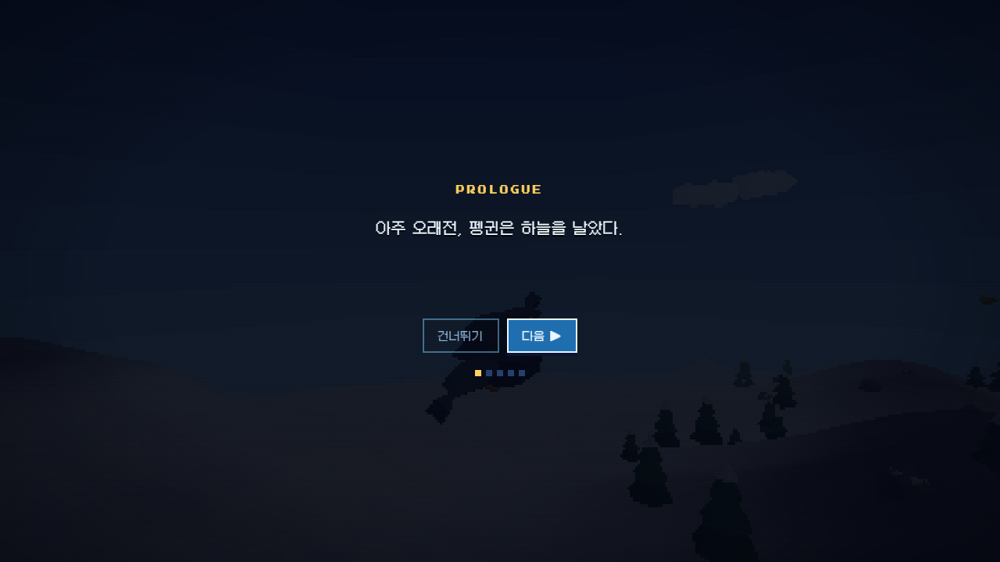 | 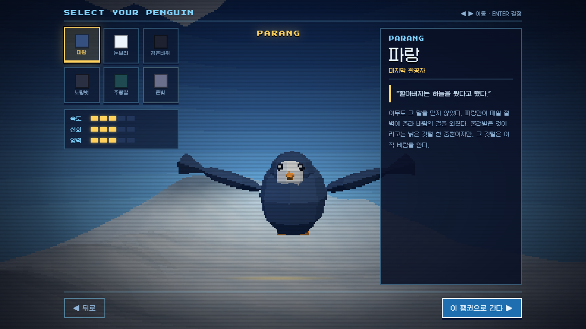 |
| 프롤로그 — 한 글자씩 찍히는 도입부 | 캐릭터 선택 — 가운데가 플레이할 모델 |
| 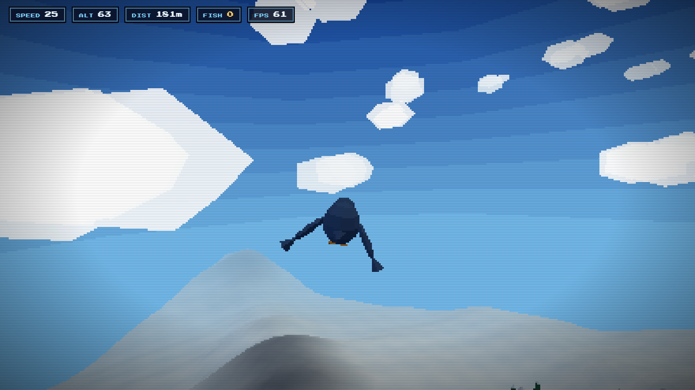 | 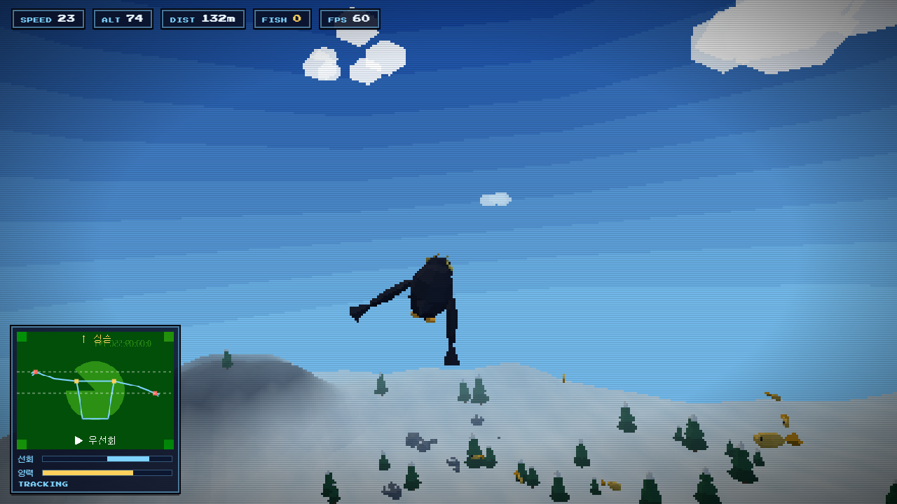 |
| 플레이 — 무한히 이어지는 설원 | 웹캠 모드 — 스켈레톤과 입력 게이지 |

---

## 조작

### 웹캠 모드

카메라에서 1~2m 떨어져 **상반신 전체(어깨·양팔)** 가 보이게 선다.

| 동작 | 결과 |
|---|---|
| 양팔 높이가 같음 | 직진 |
| 오른팔을 내림 | 오른쪽 선회 |
| 왼팔을 내림 | 왼쪽 선회 |
| 파닥파닥 날갯짓 | 상승 |
| 가만히 있음 | 하강 |

좌하단 웹캠 패널에서 인식된 스켈레톤과 현재 입력(선회/양력 게이지)을 볼 수 있다.
조작이 이상하면 이 게이지를 먼저 보면 원인이 대체로 드러난다.
HUD 우측의 `FPS` 는 성능 문제를 눈으로 확인하기 위한 것이다.

### 키보드 모드 (폴백)

웹캠이 없거나 모델 로딩에 실패해도 플레이할 수 있다.

- `←` `→` (또는 `A` `D`) — 선회
- `Space` 연타 (또는 `W` / `↑`) — 날갯짓 상승

### 신호 처리

팔 높이를 **어깨 너비 + 몸통 길이로 정규화**해서 카메라 거리·체격과 무관하게 만들었다.

```
sw      = 어깨 너비 · 몸통 길이로 만든 신체 스케일
raiseL  = (어깨L.y - 손목L.y) / sw        # 위로 들면 +
raiseR  = (어깨R.y - 손목R.y) / sw
roll    = raiseL - raiseR                 # + 면 오른팔이 낮음 → 우선회
flap    = EMA(|d((raiseL+raiseR)/2)/dt|)  # 팔 높이의 '진동 속도'
```

`roll` 은 데드존을 통과한 뒤 smoothstep 으로 ±1 에 매핑되고,
`flap` 은 상승은 빠르게 하강은 느리게 감쇠시켜 파닥이면 유지되고 멈추면 서서히 0 이 된다.

---

## 캐릭터

여섯 마리 모두 색·체형·부리·볏이 다르고, **스탯이 실제 비행에 반영된다**
(`statMul()` 이 속도/선회/양력 상수에 곱해진다).

| | | |
|---|---|---|
| 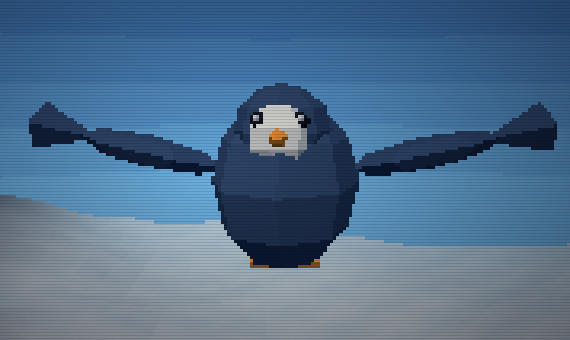 | 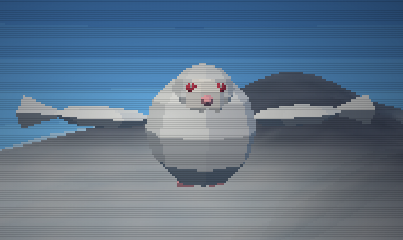 | 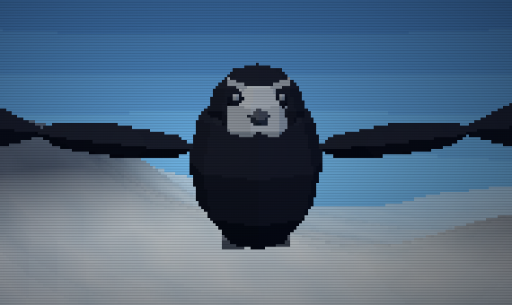 |
| **파랑** · 마지막 활공자<br>속도 3 / 선회 3 / 양력 3<br>_"할아버지는 하늘을 봤다고 했다."_ | **눈보라** · 흰 그림자<br>속도 2 / 선회 3 / 양력 5<br>_"눈과 나를 구별한 건 바람뿐이었다."_ | **검은바위** · 절벽의 다이버<br>속도 5 / 선회 2 / 양력 2<br>_"떨어지는 법은 안다. 오르는 법만 남았다."_ |
| 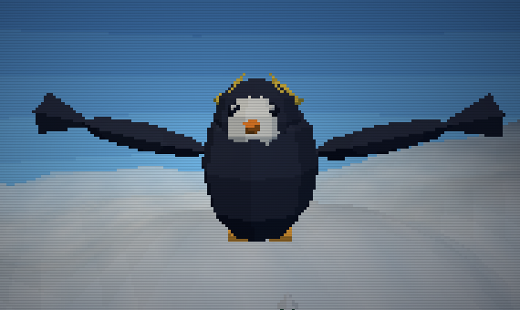 | 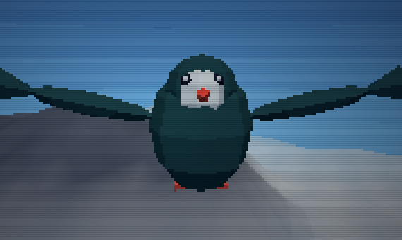 | 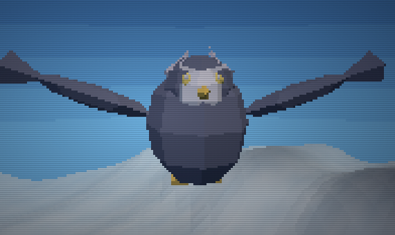 |
| **노랑볏** · 바람의 무희<br>속도 3 / 선회 5 / 양력 2<br>_"똑바로 가는 건 재미가 없잖아."_ | **주황발** · 얼음 위의 질주자<br>속도 4 / 선회 4 / 양력 1<br>_"물속에서 제일 빨랐다. 하늘이라고 다를까."_ | **은빛** · 긴 밤의 끝<br>속도 4 / 선회 4 / 양력 4<br>_"……"_ |

이름·칭호·대사·뒷이야기·외형·스탯은 전부 [js/characters.js](js/characters.js) 한 곳에 있다.
항목을 추가하면 **게임의 명단·3D 모델·소개 페이지 카드가 함께 늘어난다**
(소개 페이지도 같은 파일을 import 해서 렌더링한다).

### 세계관

> 아주 오래전, 펭귄은 하늘을 날았다.
> 바다가 넉넉해지자 펭귄들은 날개를 접고 물속으로 내려갔다. 그리고 나는 법을 잊었다.
> 그러나 긴 밤이 찾아왔다. 빙원이 갈라지고, 물고기가 자취를 감췄다.
> 남은 길은 하나뿐이다. 다시 하늘로 오르는 것.
> — 날갯짓을 기억하라.

---

## 게임 규칙

- 앞으로 계속 날아간다. 하강할수록 빨라지고, 상승할 땐 느려진다.
- 노란 **물고기**를 먹으면 `FISH` 카운트 +1, 약간의 가속 보너스.
- **나무 · 돌 · 지면**에 부딪히면 화면이 붉게 번쩍이고 튕겨 오른다 (1.4초 무적).
- 지형과 지형지물은 진행 방향 앞으로 계속 재배치되므로 끝이 없다.

---

## 실행

ES 모듈과 웹캠 권한 때문에 `file://` 로는 열 수 없다. 로컬 서버가 필요하다.

```bash
python serve.py
```

- 소개 페이지 http://localhost:8321/
- 게임 http://localhost:8321/play/

웹캠은 `localhost` 또는 `https` 에서만 허용된다.
`serve.py` 는 `Cache-Control: no-store` 를 붙인다. 코드를 고쳤는데 브라우저가 낡은 모듈을
물고 있어 반영이 안 되는 상황을 막기 위한 것이다.

최초 실행 시 MediaPipe 모델(약 6MB)을 CDN에서 내려받으므로 인터넷 연결이 필요하다.

---

## 테스트 · 스크린샷 자동 생성

```bash
cd test
npm install
npm test       # E2E 41개
npm run shots  # README / 소개 페이지용 스크린샷 13장
```

두 스크립트 모두 시스템에 설치된 Chrome(없으면 Edge)을 `puppeteer-core` 로 띄운다.
브라우저를 따로 내려받지 않는다.

### E2E — `test/e2e.mjs`

Chrome 을 `--use-fake-device-for-media-stream` 으로 띄워
**실제 getUserMedia → 실제 MediaPipe 추론 → 조작 신호 → 비행 물리** 까지
진짜 게임 루프(rAF) 위에서 돌린다. 사람 동작만 **대본 랜드마크**를 추론 출력 자리에
끼워넣어 재현하므로, 신경망 자체를 뺀 나머지 경로는 전부 실제 코드가 돈다.

| 구간 | 확인하는 것 |
|---|---|
| 화면 흐름 | 타이틀 → 프롤로그 타이핑 → 캐릭터 선택 → 조작 안내, 픽셀 폰트 로드 |
| 캐릭터 | 선택을 바꾸면 이름·스토리·스탯·3D 모델·성능 배율이 함께 바뀌는가 |
| 얼굴 방향 | 부리가 진행 방향을 향하는가, 선택 화면 카메라가 얼굴 쪽에 있는가 |
| 웹캠 기동 | 카메라 권한, wasm/모델 다운로드, `PoseLandmarker` 생성 |
| 추론 루프 | 비디오 프레임 유입, 미인식 시 `tracked=false`, 60fps 유지 |
| 프레임 예산 | 포즈 추론 1회 · 지형 재빌드 1회가 16.7ms 안에 들어오는가 |
| 조작 | 수평→직진 · 오른팔↓→우선회 · 왼팔↓→좌선회 · 날갯짓→상승 · 정지→하강 |
| 자세 안정성 | 30초 연속 선회·반복 충돌에도 화면과 펭귄이 뒤집히지 않는가 |
| 실제 사진 | 진짜 인물 사진에서 랜드마크 33개를 얻고 조작값이 정상 계산되는가 |

### 스크린샷 — `test/shots.mjs`

이 README 와 소개 페이지의 이미지는 **손으로 찍은 것이 하나도 없다.**
게임을 헤드리스로 띄워 각 화면을 캡처하며, 웹캠 컷은 대본 랜드마크를 흘려넣어
스켈레톤과 게이지가 살아 있는 상태로 찍는다. UI 를 고치면 다시 돌리기만 하면 된다.

---

## 파일 구조

```
penguin/
├── index.html          소개(랜딩) 페이지
├── play/index.html     게임
├── serve.py            개발 서버 (캐시 비활성화)
├── shots/              자동 생성 스크린샷
├── css/
│   ├── tokens.css      색·서체 토큰 (게임과 랜딩이 공유)
│   ├── style.css       게임 UI
│   └── landing.css     소개 페이지
├── js/
│   ├── main.js         게임 루프, 비행 물리, 추적 카메라, 메뉴 배경 연출
│   ├── ui.js           화면 전환 (타이틀/프롤로그/선택/모드)
│   ├── characters.js   세계관 · 캐릭터 6종 (이름/스토리/스탯/외형)
│   ├── pose.js         MediaPipe 래퍼 → {roll, flap} + 키보드 폴백
│   ├── world.js        무한 지형, 나무/돌/구름/물고기 오브젝트 풀
│   ├── penguin.js      절차적 펭귄 모델 + 날갯짓/뱅킹 애니메이션
│   └── hud.js          계기판, 웹캠 스켈레톤 오버레이
└── test/
    ├── e2e.mjs         가짜 카메라 E2E 검증
    └── shots.mjs       스크린샷 자동 생성
```

---

## 튜닝

### 비행감 — `js/main.js` 상단

| 상수 | 의미 |
|---|---|
| `BASE_SPEED` | 기본 전진 속도 |
| `TURN_RATE` | 최대 선회 각속도 (rad/s) |
| `LIFT` | 날갯짓 양력 가속도 |
| `GRAVITY` / `VY_DAMP` | 중력과 공기저항. 활공 하강 속도 = `GRAVITY / VY_DAMP` |
| `PIXEL_DIV` | 렌더 해상도 축소 배율. 크게 하면 더 거칠고(=레트로) 더 빠르다 |
| `MAX_CAM_TILT` | 카메라 수평선 기울기 상한 |

프레임이 부족하면 `PIXEL_DIV` 를 올리고(4~5), 그래도 모자라면
`js/pose.js` 의 `DETECT_HZ` 를 낮춘다(24 → 15). 추론은 메인 스레드를 막으므로
이 값이 프레임 안정성에 가장 크게 영향을 준다.

### 동작 인식 감도 — `js/pose.js` 상단

| 상수 | 의미 |
|---|---|
| `DEADZONE` | 이보다 작은 좌우 팔 높이차는 "수평"으로 본다. 키우면 직진이 안정적 |
| `ROLL_FULL` | 이만큼 차이 나면 최대 선회 |
| `FLAP_LOW` / `FLAP_HIGH` | 날갯짓 인식 하한 / 최대 양력 지점. 상승이 잘 안 되면 `FLAP_HIGH`를 낮춘다 |

### 카메라가 흔들릴 때 — `js/main.js` 의 `updateCamera()`

`camRoll` / `camPitch` 는 조작값을 느리게 따라가는 카메라 전용 필터다.
계수(`dt * 2.2`)를 낮출수록 묵직해지고, `camera.rotateZ()` 의 계수를 0 으로 두면
수평선 기울기가 사라진다.

### 디버그

콘솔에서 `PENGUIN` 핸들로 상태를 확인하거나 물리를 수동으로 진행할 수 있다.

```js
PENGUIN.state                       // 위치 / 속도 / 점수 / 선택한 캐릭터
PENGUIN.perf                        // 캐릭터 스탯에서 나온 배율
PENGUIN.ctrl = { roll: 1, flap: 0.5, tracked: true, landmarks: null, update(){} };
for (let i = 0; i < 120; i++) PENGUIN.step(1/60);   // 2초치 시뮬레이션
PENGUIN.preview(1/60)               // 메뉴 배경 연출을 한 프레임 진행
```

---

## 만들면서 고친 것들

기록해 둘 만한 것들. 전부 회귀 테스트를 붙여 막아뒀다.

**화면이 통째로 뒤집혔다.** `lookAt()` 이 카메라 쿼터니언을 새로 쓰는데,
그 뒤에 `camera.rotation.z`(오일러 각)를 대입하고 있었다. 분해 결과에 X 가
±180도 근처로 나오는 표현이 섞이면서 자세가 무너졌다. 카메라 로컬 Z 축 기준
회전(`rotateZ`)으로 바꿔 해결.

**펭귄이 뒤로 날고 있었다.** 부리·눈·얼굴을 머리의 `+Z` 쪽에 붙여둬서
얼굴이 몸통을 향했다. 진행 방향은 `-Z` 이므로 사실상 후진 비행.
몸통→부리 방향 내적이 `-0.31` 이었고, 얼굴 부품을 `-Z` 로 옮겨 `0.91` 이 됐다.

**화면이 주기적으로 끊겼다.** 지형 재빌드가 매번 5.8ms 를 먹었고 그중 4.6ms 가
`computeVertexNormals()` 였다. 지형은 규칙적인 격자라 이미 계산한 높이의 이웃
차분으로 법선을 유도할 수 있다. 재빌드 2.2ms, 빈도도 절반으로.

**낮게 날면 통통 튀었다.** 지면에 닿을 때마다 `vy` 를 +6 으로 튕기고 있었다.
충돌이 아닌 경우엔 지면을 따라 미끄러지게 바꿨다.

---

## 알려진 제약

- MediaPipe 모델과 wasm 은 CDN(jsdelivr / storage.googleapis.com)에서 받는다. 오프라인에서는 키보드 모드만 동작한다.
- 저사양 기기에서 GPU 델리게이트를 못 쓰면 자동으로 CPU 추론으로 전환되며, 이때 인식이 느려진다.
- 브라우저 탭이 백그라운드로 가면 `requestAnimationFrame` 이 멈춰 게임도 함께 멈춘다.
- 웹캠 영상은 브라우저 밖으로 나가지 않는다. 모든 인식은 페이지 안에서 처리된다.

---

## 라이선스 / 크레딧

- 서체 — [Press Start 2P](https://fonts.google.com/specimen/Press+Start+2P) (OFL), [Galmuri](https://github.com/quiple/galmuri) (OFL, Lee Minseo)
- 3D — [Three.js](https://threejs.org/) · 동작 인식 — [MediaPipe](https://ai.google.dev/edge/mediapipe)
